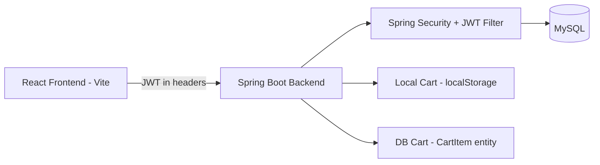

# TrendMart

Full-stack e-commerce app with JWT authentication, role-based access (USER/ADMIN), and a database-backed per-user cart, built with Spring Boot and React.


<!-- Record a 5-10s GIF: register → login → browse products → add to cart. See "Demo GIF" instructions below. -->

**Live demo:** Deploying soon

**Stack:**

    

---

## What this demonstrates

- **Full-stack auth and authorization** — JWT-based login/register with real role separation (USER/ADMIN), enforced at the API level via Spring Security, not just hidden in the UI.
- **Defense in depth on route protection** — the backend is the actual source of truth (Spring Security + JWT filter); the frontend (`ProtectedRoute`, `AdminRoute`) mirrors those rules so the UI never shows an action the API would reject.
- **Incremental, non-breaking feature design** — added a database-backed per-user cart (`CartItem` entity, `/api/cart/**`) alongside the existing working local-storage cart, rather than ripping out functioning code to add a new feature.

## Architecture



## Quick start

**Backend:**
```bash
git clone https://github.com/sudinvp/trendmart
cd trendmart/backend
# create a MySQL database matching application.properties
# default: db=projectdb, user=root — change for your machine
./mvnw spring-boot:run
```
Hibernate auto-creates the `product`, `users`, and `cart_items` tables. API runs on `http://localhost:8080`.

**Frontend:**
```bash
cd trendmart/frontend
npm install
npm run dev
```
Runs on `http://localhost:5173`, expects the API at `http://localhost:8080/api`.

**Auth config** (`backend/src/main/resources/application.properties`):
```
jwt.secret=...            # HS256 signing key — change in production
jwt.expiration=86400000   # token lifetime in ms (24h)
admin.secret.code=...     # required to self-register as ADMIN — change/remove in production
```

## Architecture decisions (the "why")

**Why enforce route protection on both the backend and the frontend, instead of just one:**
The backend (Spring Security + JWT filter in `SecurityConfig.java`) is the real source of truth — it's what actually blocks unauthorized requests. The frontend guards (`ProtectedRoute`, `AdminRoute`) exist purely for UX, so a non-admin never even sees an "Add Product" button they'd get rejected for clicking. Relying on frontend checks alone would be a security hole; the backend enforcement is what actually matters.

**Why an admin secret code for self-registration instead of a full invite/approval system:**
Registering as `ADMIN` requires an `admin.secret.code` value known only to whoever runs the deployment, so random users can't self-promote to admin through the public registration form. A full invite-and-approve flow would be more robust for a real production app, but for this project's scope, a shared secret code was a simple, defensible way to gate admin access without over-engineering an auth system.

**Why add a parallel database-backed cart instead of replacing the existing local cart:**
The app already had a working client-side cart (`Context/Context.jsx`, `Cart.jsx`) backed by `localStorage`. Rather than rewriting working code, I added a separate per-user backend cart (`CartItem` entity + `/api/cart/**`) so cart data *can* persist server-side per account. Wiring the Cart page to call the backend cart instead of (or alongside) local storage is a deliberate next step, not an oversight — see Roadmap.

See [/docs/DECISIONS.md](docs/DECISIONS.md) for the full log.

## What I struggled with

- The `pom.xml` I started from referenced Spring Boot artifact IDs that don't actually exist (`spring-boot-starter-webmvc`, `spring-boot-starter-data-jpa-test`, `spring-boot-starter-webmvc-test`) and an unreleased parent version — the project would not compile as originally set up. Had to trace each dependency against the real Spring Boot starter names and fix them one by one.
- Keeping the backend's actual permission rules and the frontend's route guards in sync — since the backend is the real enforcement layer, a mismatch would mean the UI either wrongly hides something a user *is* allowed to do, or wrongly shows something they're not.
- Deciding how to introduce the new backend cart without breaking the existing local cart that was already working — chose to add it as a parallel system rather than a risky in-place rewrite.

## Roadmap

- [x] v0.1 — Product CRUD, browsing, local cart
- [x] v0.2 — JWT auth, role separation (USER/ADMIN), route protection
- [x] v0.3 — Database-backed per-user cart (parallel to local cart)
- [ ] v0.4 — Wire Cart page to backend cart so it persists across devices
- [ ] v1.0 — Public deploy

## Code style

This repository follows the [Google Java Style Guide](https://google.github.io/styleguide/javaguide.html) for the backend and the [Google JavaScript Style Guide](https://google.github.io/styleguide/jsguide.html) for the frontend.

## Contributing

PRs welcome. Run the test suite before submitting.

## License

MIT — see [LICENSE](LICENSE).
